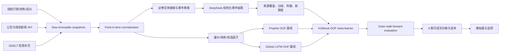

# A 股点时新闻因子与三模型耦合系统执行计划

版本：0.1（研究立项版）  
信息截止：2026-07-31（Asia/Shanghai）  
用途：内部研究与模拟盘；不是收益承诺或面向公众的证券投资建议

## 0. 先给结论

项目可以做，但应把目标从“预测某几只股票明天涨跌”改成：

> 用可追溯的全市场 A 股面板训练，在每天固定截止时刻，为关注股票输出未来 1/5/20 个交易日的行业与市场中性残差收益分数、方向概率和不确定度；只有在严格样本外、计入交易约束后仍稳定增益的新闻因子，才进入模拟盘。

文章提出的 Prophet + LSTM + XGBoost 分工思路值得保留，示例代码的结果不能作为依据。原代码先用全样本拟合 Prophet、缩放器和 LSTM，再把这些“见过测试标签”的拟合值喂给 XGBoost；这会让测试期信息直接泄漏到特征中。新方案必须改为外层 walk-forward、内层 OOF stacking，并对所有数据强制执行 `available_at <= forecast_origin`。

“所有历史 A 股 + 所有历史新闻”也不能按字面承诺：价格可尽量追溯到上市，开放新闻 API 不能提供自 1990 年以来完整、可永久存储、可用于训练的中文全文。首版应把联合价格—新闻研究期定在供应商经审计后覆盖稳定的 2014/2016 年以后；更早时期用于无新闻的价格/财务预训练与基线。

截至本计划日期，DeepSeek V4 Flash 已获官方证实，正确 API ID 是 `deepseek-v4-flash`。官方更新日志称托管 API 当前实际版本为 DeepSeek‑V4‑Flash‑0731；公开下载的 MIT 权重仍应保守标为 V4-Flash Preview，不能把两者当成同一可复现版本。[官方更新日志](https://api-docs.deepseek.com/zh-cn/updates/)；[模型与价格](https://api-docs.deepseek.com/zh-cn/quick_start/pricing/)；[官方开放权重](https://huggingface.co/deepseek-ai/DeepSeek-V4-Flash)

## 1. 项目边界与预注册问题

### 1.1 研究问题

主问题：在纯价量、行业、规模、流动性、波动率等基线之上，点时可得的多来源新闻结构因子是否能稳定提高未来 5 个交易日的横截面排序质量和成本后组合表现？

次问题：

1. Prophet/LSTM 的严格 OOF 输出是否能给 XGBoost 带来增量，而不是只增加复杂度？
2. LLM 的结构化事件因子是否显著优于普通正负情绪？
3. “类似 Ground News”的覆盖广度、来源集中度和跨来源分歧，是否包含独立于新闻热度/公司市值的增量信息？
4. 该增量在牛市、熊市、震荡市以及大小盘/行业子样本中是否稳定？

### 1.2 明确不做

- 不预测未经平稳化的原始股价 level；
- 不把一次 80/20 切分或测试集调参后的曲线当作证据；
- 不假设所有 A 股可做空；首版只做 long-only 与基准比较；
- 不自动下单，不面向公众输出“买/卖某股”或承诺收益；
- 不抓取无授权全文、绕过付费墙或把 SDK 的开源许可证误当成数据授权；
- 不在本机下载 284B 参数的 DeepSeek 权重冒充 API 0731 版本。

## 2. 从原文三模型到可检验的耦合

### 2.1 模型职责

| 模块 | 原文角色 | 本项目中的限定角色 | 可被淘汰的条件 |
|---|---|---|---|
| Prophet | 趋势/周期 | 指数、行业、成交量和波动状态的可解释低频基线；不默认逐股产生 alpha | 所有外层折均无增量，或仅学习到日历伪影 |
| LSTM | 复杂时序依赖 | 全市场共享的 panel/global 序列模型，输入 20/60/120 日量价与状态，输出多期限残差收益/方向分数 | 不胜过线性、TCN/简单动量基线，或跨 regime 不稳 |
| XGBoost | 最终修正 | 二层 meta learner；只接收严格 OOF 的基模型预测、点时结构化因子和新闻聚合因子 | LightGBM LambdaRank/CatBoost 稳定胜出时降为基线 |

目标不是强行保留三者，而是让每个模块通过消融实验“挣得”存在资格。

### 2.2 正确的 OOF stacking

1. 外层按完整交易日做 expanding walk-forward；同一天所有股票必须位于同一折。
2. 每个外层训练窗内部再做 expanding folds。
3. 每个内层折只在过去拟合 Prophet、LSTM 和缩放器，并对紧随其后的验证块生成真正 OOF 预测。
4. 将这些 OOF 预测与当时可得的结构化/新闻因子组成 `meta_train`，再拟合 XGBoost。
5. 外层测试时，基模型只用外层训练窗重训，XGBoost 只吃当时可生成的基模型输出；标签揭示后才允许下一次更新。
6. 标签为 h 日收益时，purge 所有与验证/测试标签区间重叠的训练样本，并设置 embargo；同一新闻事件簇不能跨折。
7. 最终留出期封存，只允许一次评估；调参、prompt 选择和因子筛选均不能看它。

文章中 `shift(1)` 后的 lag/rolling 思路可以保留；全量 Prophet、全量 scaler、全量 LSTM 和 in-sample 预测必须全部替换。

## 3. 端到端架构



### 3.1 存储分层

- Bronze：供应商原始响应/文件不可变保存，记录抓取批次、许可、哈希和校验和；
- Silver：统一证券 ID、时区和 `published_at / first_seen_at / available_at`；保留历史更名、退市、ST、停牌和成分有效期；
- Gold：按 forecast origin 生成的因子快照、标签和 OOF 预测；每一行附 `data_version`；
- Artifact：模型、缩放器、prompt/schema、包锁文件、随机种子、Git commit、回测订单和成交记录。

MVP 用 Parquet + DuckDB；Qlib 负责研究工作流和 A 股回测骨架。数据量、并发或多人权限成为瓶颈后，再迁移到对象存储与分析型数据库，不在首版提前引入复杂分布式系统。

训练运行时将 Prophet、LSTM 与树模型放在独立 worker 进程中，数据通过版本化 Parquet/模型 artifact 交换。这既贴合 OOF 训练单元，也隔离本地数值库故障。当前 Apple Silicon 环境已验证每个模型单独拟合成功，但复现到 Torch 先加载、随后拟合 XGBoost 3.3 时的 OpenMP 进程崩溃；不采用 `KMP_DUPLICATE_LIB_OK` 掩盖问题。[相关 PyTorch macOS/ARM OpenMP issue](https://github.com/pytorch/pytorch/issues/149201)

## 4. 数据方案：先审权利，再谈“全历史”

### 4.1 行情、主数据和财务

| 层级 | 推荐用途 | 能力与限制 | 决策 |
|---|---|---|---|
| 有点时授权的商业数据 | 生产研究主源 | 应包含退市股、历史成分、复权/公司行动、ST/停牌、真实公告时点与修订快照 | 采购前做合同与样本审计 |
| Tushare Pro | PoC 统一源 | 有股票主表、日线、复权因子、成分与财务；新闻需单独权限。标准协议并不等于商业授权 | 原型首选，不作为默认商用权利 |
| AKShare | 交叉校验 | 代码 MIT，但很多接口依赖网页上游；MIT 不授权上游数据，结构/限流可能变化 | QA only |
| BaoStock | 免费行情复核 | 可做价格交叉验证，新闻不足，数据使用受其条款约束 | QA only |
| 上交所/深交所/巨潮公告 | 高精度公司事件 | 第一方披露可靠，但未发现可无条件批量商用的正式公开 API | 授权接入或采购镜像 |

关键文档：[Tushare 股票主数据](https://tushare.pro/document/1?doc_id=25)、[日线](https://tushare.pro/document/1?doc_id=27)、[复权因子](https://tushare.pro/document/2?doc_id=28)、[财务指标](https://tushare.pro/document/2?doc_id=79)、[数据协议](https://tushare.pro/document/1?doc_id=405)、[AKShare](https://github.com/akfamily/akshare)、[BaoStock](https://baostock.com/)、[巨潮资讯](https://www.cninfo.com.cn/new/index?islogin=false&language=cn)、[上交所公告](https://www.sse.com.cn/assortment/stock/list/info/announcement/index.shtml)、[深交所公告](https://www.szse.cn/disclosure/notice/company/index.html)。

复权尤其容易污染：今天计算出的前复权序列会随查询终点变化，不能把它当作历史时点曾经可见的序列。原始 OHLC 与公司行动应分开保存，在每个历史 forecast origin 生成可复现的变换。

### 4.2 历史新闻

| 来源 | 可用范围/优势 | 不适合作为唯一主源的原因 |
|---|---|---|
| 授权中文新闻库 / NewsAPI.ai(Event Registry) | 官方称档案自 2014 年，提供全文、实体、概念、情绪和事件聚类 | 商业合同；需书面确认中文覆盖、历史回填、永久存储、模型训练和衍生因子权利 |
| Tushare `major_news` / 快讯 | 中文财经 PoC 方便，文档称分别超过 8 年/6 年 | 权限与调用上限；实体字段不足；授权边界需确认 |
| GDELT 2.0 bulk GKG/Event | 2015-02-19 起的全球宏观、来源多样性与传播补充 | DOC API 只有滚动窗口；中国公司覆盖和证券映射不足；原文版权仍属出版方 |
| NewsAPI.org | 接口简单 | 当前只覆盖最近 5 年、正文截断，开发套餐非生产，并限制竞争性新闻库用途 |
| 交易所/公司公告 | 公司事件精度高 | 不等于综合新闻；批量接口与授权需解决 |

关键文档：[Tushare 长篇新闻](https://tushare.pro/document/2?doc_id=195)、[新闻快讯](https://tushare.pro/document/2?doc_id=143)、[GDELT data](https://www.gdeltproject.org/data.html)、[GDELT 2.0 GKG codebook](https://data.gdeltproject.org/documentation/GDELT-Global_Knowledge_Graph_Codebook-V2.1.pdf)、[NewsAPI.org Everything](https://newsapi.org/docs/endpoints/everything)、[NewsAPI.ai 文档](https://www.newsapi.ai/documentation)。

建议的可审计分期：

- 价格/上市状态：尽可能从每只股票上市日起；
- 价格+财务：从点时财务和修订记录可验证的日期起；
- 中文公司新闻：暂定 2016 年起，最终由覆盖审计决定；
- GDELT/商业聚合：2014/2015 年起；
- 早期无新闻期：只作量价预训练/结构稳定性研究，不能填充为“无新闻”。

## 5. 类 Ground News 的量化新闻因子

Ground News 将同一事件的多来源报道聚合，并比较来源的偏向、事实性与所有权。这里借用“多来源对照”的结构，不复制其专有政治偏见分数；财经场景更适合可审计的来源类型、独立性、覆盖熵、跨来源分歧、首发领先度和更正率。[Ground News 方法概览](https://ground.news/about)；[来源筛选维度](https://help.ground.news/en/articles/6049857)

### 5.1 单篇文章的 LLM 抽取字段

`entity_ids, event_type, polarity, materiality, uncertainty, relevance, horizon, facts, claims, confidence`

规则：

- LLM 只做结构化抽取，不直接输出股票目标价或买卖建议；
- 使用非思考模式、固定 prompt/schema，本地 Pydantic 校验；空 JSON、越界、缺字段进入隔离队列并重试；
- 保存输入哈希、requested/response model、system fingerprint（如有）、时间、prompt 版本和原始 JSON；
- 云 API 的模型 ID 是会升级的别名，必须缓存每次因子结果，不能事后重跑并覆盖历史；
- API key 只放服务端密钥管理，不进入浏览器、客户端、日志或 Git。

DeepSeek JSON mode 能保证 JSON 字符串，但官方提示偶有空输出，不能替代本地 schema 校验。[JSON Output](https://api-docs.deepseek.com/guides/json_mode/)；[模型列表](https://api-docs.deepseek.com/api/list-models)

### 5.2 事件簇聚合因子

先用 URL canonicalization、正文哈希、标题/正文相似度和时间窗把转载合并为事件簇，再计算：

- `independent_source_count = n(unique publisher_group_id)`；
- `coverage = log1p(independent_source_count)`；
- `source_entropy = -sum(p_k log p_k) / log(K)`；
- `disagreement = weighted_std(article_polarity)`；
- `novelty = 1 - max_similarity(current_event, previous_60d_events)`；
- `propagation_velocity = log1p(sources_within_6h) / (hours_to_nth_source + 1)`；
- `official_media_gap = official_polarity - media_polarity`；
- `correction_or_retraction`, `source_concentration`, `first_source_class`；
- `decayed_event_score = sum(materiality * relevance * confidence * polarity * exp(-age/half_life))`，半衰期 2/8/24/72 小时；
- 公司、行业、宏观三级暴露；多公司文章按实体相关度分配权重。

必须控制公司市值、常态新闻量、行业、来源总量和市场波动，否则“覆盖广度/分歧”可能只是大公司热度代理。

### 5.3 实体链接

建立有有效期的证券主表：统一 security ID、代码、法定名、历史简称/曾用名、品牌、子公司、行业、上市/退市日。高置信规则匹配优先，LLM 只做候选消歧；歧义无法消除时弃权。对随机抽样的高置信链接要求人工 precision 达标后才扩大回填。

## 6. DeepSeek V4 Flash 的独立接入与可复现性

### 6.1 托管 API 路线（MVP）

- OpenAI-compatible base URL：`https://api.deepseek.com`；
- model：`deepseek-v4-flash`；
- 默认非思考模式，用 JSON mode + 本地验证；
- 业务代码只依赖 provider-neutral 配置：`LLM_BASE_URL / LLM_API_KEY / LLM_MODEL`；
- 服务端批处理带限速、退避、幂等键、缓存、失败隔离和预算上限；
- 每批先跑 1,000/10,000/100,000 篇阶梯试验，确认质量与 token 分布后再全量回填。

按 2026-07-31 中文价格页，Flash 每百万未缓存输入 token 1 元、输出 2 元。若 N 篇平均输入 `T_in`、输出 `T_out`，未计缓存的估算费用为：

`cost_CNY = N * (T_in * 1 + T_out * 2) / 1,000,000`

例如 500 万篇、平均 800 输入 + 150 输出 token，约为 5,500 元；这只是 token 估算，不含新闻授权、存储、失败重试和工程成本，且价格可变。

### 6.2 自托管路线（独立阶段）

官方开放权重为 284B 总参数、13B 激活、1M 上下文，MIT；但公开模型卡仍称 Preview，当前未证实有可下载的 0731 正式 API 权重。本地部署需多 GPU/节点、vLLM/SGLang 兼容与容量测试，不是这台 Apple Silicon 机器的普通依赖。自托管的立项条件是：云数据条款无法满足、稳定月调用量足以覆盖硬件/运维、且完成输出一致性对比。

### 6.3 一个不能忽略的“模型记忆泄漏”

用 2026 年 LLM 处理 2015 年新闻，即使输入文本的时间戳正确，模型预训练知识仍可能知道事件后果。这与普通特征前视不同，无法靠 `available_at` 完全消除。因此：

1. LLM 只抽取事件语义，不询问未来回报；
2. 全期同时跑不含 LLM 的确定性文本/情绪基线；
3. 设模型发布日期之后的时间干净测试集；
4. 做公司名/日期遮蔽挑战集，检查是否出现超出原文的未来事实；
5. 使用冻结的较小中文模型作对照；
6. 历史 LLM 回填只能称“研究性回测”，不能宣称完全无泄漏；真正证据来自上线后冻结模型的前瞻模拟盘。

## 7. 标签、特征与训练样本

### 7.1 决策与标签

- forecast origin：交易日 t 18:00 CST；
- 最早执行：t+1 开盘，加入可实现的延迟与滑点；
- 主标签：t+1 开盘到 t+5 收盘的对数收益，减去行业和宽基收益；
- 次标签：1/20 日残差收益、方向概率、横截面顶部收益分位；
- 所有特征只能使用 t 18:00 前 `available_at` 的记录；收盘后/周末消息映射到下一个交易日。

### 7.2 训练面板

训练使用当时可投资的流动性合格全市场面板，而不是只用用户关注的几只股票；推理结果再筛选到关注列表。这样能增加横截面广度，减少单股 LSTM 的样本不足。每日重建 universe，保留之后退市的股票和当时的 ST/停牌/新股状态，绝不使用今天的股票列表回溯。

### 7.3 基线与挑战模型

硬基线：零预测、行业均值、动量/反转、Ridge/ElasticNet、纯价量 XGBoost、单独 Prophet、单独 LSTM、基模型简单平均。

主模型：XGBoost 回归与 pairwise ranking。挑战者：LightGBM LambdaRank、CatBoost、ElasticNet。Qlib 已提供 Alpha158/Alpha360、中国市场样例和端到端训练/回测框架，适合作为主干，但公开样例数据不是生产数据。[Qlib 仓库](https://github.com/microsoft/qlib)；[Qlib 论文](https://arxiv.org/abs/2009.11189)

## 8. 验证、交易仿真与统计门槛

### 8.1 切分

- outer：最少 756 个训练交易日，63 日测试块，63 日步长，expanding；
- inner：5 个时间顺序 OOF folds；
- purge：至少覆盖最大 20 日标签区间；
- embargo：初始 5 日，并按特征和执行延迟压力测试；
- CPCV：只作内层稳健性检查，不能替代最终严格按时间顺序的 outer test；
- final holdout：完全封存；
- 同一事件簇和近重复文章不得跨折。

### 8.2 A 股执行约束

回测必须模拟：T+1、100 股整数手、停牌、涨跌停不可成交、集合竞价/开盘滑点、佣金、卖出印花税、成交量参与率、冲击成本、ST/退市处理和融资融券资格。首版 long-only top-k 对基准；因子诊断中的 top-minus-bottom 仅作统计组合，不冒充可直接成交策略。

### 8.3 指标

- 预测：IC、RankIC、ICIR、方向 AUC/准确率、概率校准、分层收益；
- 组合：成本前后年化收益、信息比率/Sharpe、最大回撤、换手、容量、暴露与成交失败率；
- 稳健性：各 outer fold/市场 regime/行业/大小盘的分布，Deflated Sharpe、PBO 和多重检验校正；
- 数据：覆盖率、实体链接 precision、事件聚类 precision、延迟分布、点时断言失败数；
- LLM：schema 通过率、重试率、空输出率、人工一致性、单位文章 token/费用。

### 8.4 必做消融

1. 纯价量；2. 纯文本；3. 价量+普通情绪；4. 价量+LLM 事件；5. 完整多来源因子；6. 去掉 Prophet；7. 去掉 LSTM；8. 去掉单个新闻源/GDELT；9. 新闻时间整体延迟 5/30/60 分钟；10. 不同 LLM/冻结中文小模型。

升级门槛预先写入实验注册表：新闻模型必须在多数外层折、多个 regime 中对价格基线产生费用后增量，置信区间与多重检验仍通过，且不由单一来源/单一行业驱动。未通过则停止，而不是继续在最终测试期调参。

## 9. 开源框架取舍

| 项目 | 许可证/状态 | 用法 |
|---|---|---|
| Qlib | MIT | 主干：数据处理、模型工作流、因子与 A 股回测 |
| XGBoost | Apache-2.0 | 文章对应的 meta learner 与硬基线 |
| LightGBM | MIT | 横截面 LambdaRank 主挑战者 |
| CatBoost | Apache-2.0 | 类别/行业特征与 ordered boosting 挑战者；不能解决时间泄漏 |
| skfolio | BSD-3-Clause | CPCV、组合与稳健性工具；外层仍用严格 walk-forward |
| FinGPT | MIT | 参考数据工程/LoRA/金融 NLP，不作为 A 股 alpha 证据 |
| Astock | 仓库未见 LICENSE | 只读论文/设计参考，不复制代码/数据 |
| Alphalens | Apache-2.0、项目较旧 | 不纳入主依赖；Qlib/skfolio 覆盖主要诊断 |
| backtrader | GPL-3.0 | 暂不纳入商业集成 |
| vectorbt | Apache-2.0 + Commons Clause | 不按普通 Apache 商用友好依赖处理 |
| mlfinlab | 当前非开放/premium | 不纳入开源依赖 |
| FinRL | MIT | 仅后期 RL 对照，不干扰首版 GBDT 基线 |

官方入口：[LightGBM](https://github.com/microsoft/LightGBM)、[CatBoost](https://github.com/catboost/catboost)、[XGBoost](https://github.com/dmlc/xgboost)、[skfolio](https://github.com/skfolio/skfolio)、[FinGPT](https://github.com/AI4Finance-Foundation/FinGPT)、[Astock](https://github.com/JinanZou/Astock)、[FinRL](https://github.com/AI4Finance-Foundation/FinRL)。

## 10. 论文阅读与可复现基线

按实施优先级：

1. Gu, Kelly & Xiu, *Empirical Asset Pricing via Machine Learning*：树与神经网络的横截面收益基线、严格样本外思路。[RFS](https://academic.oup.com/rfs/article/33/5/2223/5758276)
2. Qlib：可复现实验工作流与中国市场基准。[论文](https://arxiv.org/abs/2009.11189)
3. LightGBM / XGBoost / CatBoost：主表格模型与挑战模型。[LightGBM 论文](https://proceedings.neurips.cc/paper_files/paper/2017/hash/6449f44a102fde848669bdd9eb6b76fa-Abstract.html)、[XGBoost 论文](https://dl.acm.org/doi/10.1145/2939672.2939785)、[CatBoost 论文](https://proceedings.neurips.cc/paper/2018/hash/14491b756b3a51daac41c24863285549-Abstract.html)
4. FinBERT 与 FinGPT：金融文本基线与低成本微调；英文模型不能直接视为中文 A 股适配。[FinBERT](https://arxiv.org/abs/1908.10063)、[FinGPT](https://arxiv.org/abs/2306.06031)
5. 中国股票 LLM 研究：短样本 PoC，提醒“小中文情绪模型可能胜过通用大模型”。[arXiv:2306.14222](https://arxiv.org/abs/2306.14222)
6. Astock：中文新闻+因子设计参考，但数据/代码授权与可交易假设需重审。[ACL Anthology](https://aclanthology.org/2022.finnlp-1.24/)
7. LLM newsflow：文本表示可能优于单一情绪，但证据来自非 A 股市场。[EMNLP Industry 2024](https://aclanthology.org/2024.emnlp-industry.77/)
8. 新闻覆盖、新颖度与投资者行为：[Tetlock 2007](https://onlinelibrary.wiley.com/doi/abs/10.1111/j.1540-6261.2007.01232.x)、[Engelberg & Parsons 2011](https://onlinelibrary.wiley.com/doi/10.1111/j.1540-6261.2010.01626.x)、[NBER w24430](https://www.nber.org/papers/w24430)
9. 回测过拟合与协议：[Probability of Backtest Overfitting](https://papers.ssrn.com/sol3/Papers.cfm?abstract_id=2326253)、[A Backtesting Protocol in the Era of Machine Learning](https://papers.ssrn.com/sol3/papers.cfm?abstract_id=3275654)
10. 原始模型背景：[Prophet](https://facebook.github.io/prophet/)、[LSTM](https://doi.org/10.1162/neco.1997.9.8.1735)

## 11. 执行里程碑、交付物与停止条件

### Phase 0：许可与覆盖审计（第 1 周）

交付：供应商合同清单、20 个随机交易日/100 只股票样本、字段/时区/延迟报告、允许存储/训练/衍生/再分发的权利矩阵。  
停止条件：拿不到点时历史、退市/修订数据或新闻训练权利，则不能宣称“全历史”，缩成授权范围内 PoC。

### Phase 1：点时数据底座（第 2–3 周）

交付：Bronze/Silver schema、证券历史主表、交易日历、公司行动、公告/新闻 ingestion、内容哈希与数据质量测试。  
门槛：所有 Gold 特征 `available_at <= forecast_origin`；日期/股票随机切分测试必须失败；抽样实体链接和事件去重达到预注册精度。

### Phase 2：无新闻硬基线（第 4 周）

交付：Qlib Alpha158 类量价基线、ElasticNet/XGBoost/LightGBM、A 股成本和可成交约束、outer walk-forward 报告。  
停止条件：连无新闻基线和回测撮合都不可复现，不进入 LLM 阶段。

### Phase 3：新闻与 DeepSeek 因子（第 5–6 周）

交付：事件聚类、实体链接、LLM schema/缓存/重试、10 万篇质量与费用报告、确定性文本基线。  
门槛：schema/人工一致性通过，云输入权利与隐私风险已确认。

### Phase 4：三模型 OOF stacking（第 7–8 周）

交付：Prophet/LSTM OOF 预测、XGBoost meta、LightGBM/CatBoost 挑战、purge/embargo、完整消融与多重检验。  
停止条件：新闻或三模型在严格外层样本外无稳定增量，就回退到更简单模型。

### Phase 5：封存留出与模型卡（第 9 周）

交付：一次性 final holdout、数据卡/模型卡/风险卡、可复现锁文件、审计日志、失败案例。不得回到留出期调参。

### Phase 6：前瞻模拟盘（至少 60 个交易日，约 3 个月）

交付：每日冻结信号、实际可成交模拟、API/数据延迟、漂移、成本差异和事故复盘。只有前瞻结果与回测在预注册容差内，才讨论小额实盘与券商/合规接入。

## 12. 主要风险与控制

| 风险 | 控制 |
|---|---|
| 新闻历史不完整/许可不足 | 供应商权利矩阵；明确研究起点；不把缺失当“无新闻” |
| 幸存者、成分、复权、财务修订泄漏 | 有效期主表、原始 OHLC/公司行动分离、公告日与修订快照 |
| 原文式 stacking 泄漏 | 内层 OOF、外层 walk-forward、scaler 每折 fit、自动点时断言 |
| 现代 LLM 记得历史后果 | 只抽取语义、时间干净测试、冻结小模型/确定性基线、前瞻模拟盘 |
| API alias 升级导致因子漂移 | 永久缓存输出与版本元数据；canary；provider-neutral fallback |
| 新闻转载放大热度 | 先聚类后聚合；publisher group 去重；事件簇不跨折 |
| A 股不可成交与成本低估 | T+1/涨跌停/停牌/整数手/容量/冲击模型；实际券商参数必填 |
| 多次试验挖出伪因子 | 预注册、final holdout、PBO/Deflated Sharpe、多重检验 |
| 云端数据/隐私/商业秘密 | 最小化/脱敏；书面确认 retention/training；高敏数据转自托管 |
| 公众荐股/程序化交易合规 | 首版内部研究/模拟盘；公众产品与自动交易另行资质和合规评审 |

若对公众提供具体证券预测/买卖时机功能或自动下单，需要单独评估证券投资咨询、生成式 AI、内容标识和程序化交易要求；内部研究边界不能自动延伸为对外服务。[生成式 AI 暂行办法](https://www.cac.gov.cn/2023-07/13/c_1690898327029107.htm)、[AI 生成内容标识办法](https://www.cac.gov.cn/2025-03/14/c_1743654685896173.htm)、[证监会程序化交易规定](https://www.csrc.gov.cn/csrc/c100028/c7480577/content.shtml)

## 13. 当前仓库已落地的执行入口

- `pyproject.toml`：Python 3.12 依赖与开发工具；
- `.env.example`：DeepSeek/数据源服务端配置，无密钥；
- `configs/research.yaml`：目标、切分、因子、模型、交易约束和 gate；
- `src/elucidator/contracts.py`：带时区的新闻点时契约与前视断言；
- `src/elucidator/llm.py`：OpenAI-compatible DeepSeek JSON 抽取适配器；
- `src/elucidator/preflight.py`：依赖/API 预检；
- `tests/test_contracts.py`：未来数据与无时区时间戳必须被拒绝。

本地命令：

```bash
/opt/homebrew/bin/python3.12 -m venv .venv
.venv/bin/python -m pip install -e '.[dev]'
.venv/bin/elucidator-preflight
.venv/bin/pytest
.venv/bin/python -m pip freeze > requirements.lock.txt
```

数据、DeepSeek 调用与实盘均需要用户自己的合法授权/API key；无 key 时环境和合同测试可以完整运行，但系统不会伪造数据或产生荐股结论。

## 14. 立项决策

建议批准“受限 PoC”，但附四个硬条件：

1. 先采购/确认新闻与行情的点时和训练权利；
2. 先完成无新闻的可复现基线，再引入 LLM；
3. 所有结论只来自外层 walk-forward、封存留出和前瞻模拟盘；
4. 任一复杂模块若不能稳定增加费用后表现，就从生产方案中删除。

这比直接照搬文章代码慢一些，但它把真正决定项目成败的四件事——数据权利、时间戳、泄漏控制和可成交性——放在了模型调参之前。
